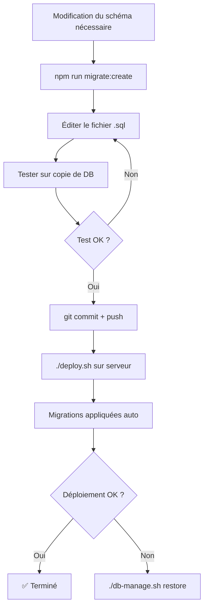

# 📦 Système de Migrations - CrossFit Audit

## 📁 Structure complète

```
crossfit-audit/
├── backend/
│   ├── migration-manager.js          ← Moteur de gestion des migrations
│   ├── migrations.js                 ← Script CLI pour utiliser le système
│   ├── MIGRATIONS_README.md          ← Documentation complète
│   ├── package.json                  ← Ajouter les scripts npm
│   │
│   ├── migrations/                   ← Dossier des fichiers de migration
│   │   ├── .gitignore                ← Ignore les exemples
│   │   ├── 20250127_000001_add_audit_status_field.sql
│   │   ├── 20250127_000002_create_audit_comments_table.sql
│   │   ├── 20250127_000003_add_gym_contact_info.sql
│   │   └── EXAMPLE_restructure_table.sql  ← Exemple avancé
│   │
│   └── database/
│       └── crossfit_audit.db         ← Base de données
│
├── deploy.sh                         ← Script de déploiement MODIFIÉ
├── db-manage.sh                      ← Utilitaire backup/restore
├── INSTALL_MIGRATIONS.sh             ← Script d'installation
├── QUICKSTART_MIGRATIONS.md          ← Guide rapide
│
└── backups/                          ← Sauvegardes automatiques
    └── crossfit_audit_backup_*.db
```

## 📄 Description des fichiers

### Fichiers principaux (backend/)

| Fichier | Description | Usage |
|---------|-------------|-------|
| **migration-manager.js** | Moteur de gestion des migrations | Géré automatiquement par migrations.js |
| **migrations.js** | Script CLI principal | `node migrations.js [commande]` |
| **MIGRATIONS_README.md** | Documentation complète | Référence pour tout savoir |

### Scripts utilitaires (racine)

| Fichier | Description | Usage |
|---------|-------------|-------|
| **deploy.sh** | Déploiement avec migrations auto | `./deploy.sh` |
| **db-manage.sh** | Gestion backup/restore | `./db-manage.sh [commande]` |
| **INSTALL_MIGRATIONS.sh** | Installation du système | `./INSTALL_MIGRATIONS.sh` (une fois) |

### Documentation

| Fichier | Description | Pour qui ? |
|---------|-------------|------------|
| **MIGRATIONS_README.md** | Doc complète avec exemples | Tout le monde |
| **QUICKSTART_MIGRATIONS.md** | Guide de démarrage rapide | Débutants |
| **INDEX.md** | Ce fichier (vue d'ensemble) | Vue d'ensemble |

### Exemples de migrations (migrations/)

| Fichier | Type | Description |
|---------|------|-------------|
| **20250127_000001_*.sql** | Ajout colonne | Ajoute un champ status |
| **20250127_000002_*.sql** | Nouvelle table | Crée table comments |
| **20250127_000003_*.sql** | Ajout colonnes | Contact info pour gyms |
| **EXAMPLE_restructure_table.sql** | Restructuration | Exemple avancé (à adapter) |

## 🚀 Démarrage en 3 étapes

### 1. Installation (une seule fois)
```bash
cd /home/ubuntu/crossfit-audit
chmod +x INSTALL_MIGRATIONS.sh
./INSTALL_MIGRATIONS.sh
```

### 2. Créer votre première migration
```bash
cd backend
npm run migrate:create add_my_field
# Éditer le fichier créé
npm run migrate
```

### 3. Déployer
```bash
cd ..
./deploy.sh
# Les migrations s'appliquent automatiquement !
```

## 📚 Où trouver quoi ?

| Je veux... | Fichier à consulter |
|------------|---------------------|
| **Comprendre le système** | `MIGRATIONS_README.md` (section "Pourquoi") |
| **Créer ma première migration** | `QUICKSTART_MIGRATIONS.md` |
| **Voir des exemples** | Dossier `migrations/` |
| **Gérer les sauvegardes** | `MIGRATIONS_README.md` (section "Rollback") |
| **Dépanner un problème** | `QUICKSTART_MIGRATIONS.md` (section "Problèmes") |
| **Migration complexe** | `EXAMPLE_restructure_table.sql` |
| **Commandes disponibles** | `npm run migrate help` ou `./db-manage.sh help` |

## 🎯 Commandes essentielles

### Migrations
```bash
cd backend

# Créer une migration
npm run migrate:create <nom>

# Voir le statut
npm run migrate:status

# Appliquer les migrations
npm run migrate
```

### Base de données
```bash
cd /home/ubuntu/crossfit-audit

# Sauvegarder
./db-manage.sh backup

# Lister les sauvegardes
./db-manage.sh list

# Restaurer
./db-manage.sh restore

# Voir le statut complet
./db-manage.sh status
```

### Déploiement
```bash
cd /home/ubuntu/crossfit-audit

# Déployer (fait tout automatiquement)
./deploy.sh
```

## ✅ Checklist d'installation

- [ ] Fichiers copiés dans `/home/ubuntu/crossfit-audit/backend/`
- [ ] Scripts npm ajoutés au `package.json`
- [ ] Permissions exécution: `chmod +x deploy.sh db-manage.sh`
- [ ] Test: `npm run migrate:status` fonctionne
- [ ] Dossier `migrations/` créé avec exemples
- [ ] Documentation lue: `MIGRATIONS_README.md`
- [ ] Premier déploiement testé: `./deploy.sh`

## 🔗 Workflow complet



## ⚠️ Règles d'or (rappel)

1. ✅ **TOUJOURS** tester sur une copie
2. ❌ **JAMAIS** modifier une migration appliquée
3. ✅ **TOUJOURS** faire une sauvegarde manuelle avant modification risquée
4. ❌ **JAMAIS** supprimer des données sans sauvegarde
5. ✅ Le système fait des sauvegardes auto avant chaque déploiement

## 🆘 Support

**Problème avec les migrations ?**
1. Consulter `QUICKSTART_MIGRATIONS.md` → Section "Problèmes courants"
2. Consulter `MIGRATIONS_README.md` → Section "FAQ"
3. Vérifier les logs: `npm run migrate`

**Besoin de restaurer ?**
```bash
./db-manage.sh list      # Voir les sauvegardes
./db-manage.sh restore   # Restaurer la dernière
```

## 📈 Statistiques

Ce système de migrations vous apporte:
- ✅ **0 perte de données** lors des déploiements
- ✅ **Sauvegardes automatiques** avant chaque modification
- ✅ **Rollback en 1 commande** en cas de problème
- ✅ **Historique complet** de toutes les modifications
- ✅ **Déploiement automatisé** avec `./deploy.sh`

---

**Version**: 1.0.0  
**Date**: 27 janvier 2025  
**Auteur**: Claude (Anthropic)  
**Projet**: CrossFit Audit - Tulip Conseil
